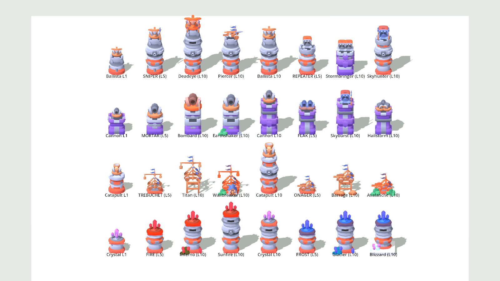

# Tower branches and the Crystal Tower (design)

At the level 4 → 5 milestone you pick one of two **branches**; at 9 → 10 one of two **specialisations**
within it. With a fourth tower that is 4 towers × 2 × 2 = **16 end-forms**. The milestone's ×2 / ×3 damage
and cost rules stay; branches reshape *how* the damage is dealt. Milestones pay more than they cost (4 → 5
is ×2 damage for +70% of the investment, 9 → 10 is ×3 for +160%), so committing to a tower is rewarded;
between branches damage per gold stays roughly even (±15%): each form is stronger in its niche, never simply better.

Rows: Ballista, Cannon, Catapult, Crystal. Each row: today's L1 · branch A (L5) · A1 · A2 (L10) · today's L10 ·
branch B (L5) · B1 · B2 (L10). Numbers below are multipliers on the unbranched tower at the same level.

## Roles
| Tower | Role | Hits air | Bonus |
|---|---|---|---|
| Ballista | All-rounder, anti-air | Yes | — |
| Cannon | Crowds, armour | Yes | ×1.5 vs armoured |
| Catapult | Bosses, tanks, siege | No (Scatter Shot) | ×1.75 vs bosses & tanks |
| **Crystal** (new) | Elements: control or burn | Yes | Ignores half of armour |

## Ballista
| Form | Level | Stats | Excels / Weak |
|---|---|---|---|
| **Sniper** | 5 | Damage ×2, fire rate ×0.5, range +1.2, 20% crit for ×2 | Bosses, armour / crowds |
| ↳ **Deadeye** | 10 | Crit 35% for ×3; executes non-boss creeps under 12% HP | Elites, bosses / swarms |
| ↳ **Piercer** | 10 | Bolts pierce a line of 3 (100 / 70 / 50%) | Lines of ground creeps / spread-out flyers |
| **Repeater** | 5 | Fire rate ×3, damage ×0.4, range −0.2; Slowing/Splitting proc per hit | Flyers, fast creeps / armour |
| ↳ **Stormbringer** | 10 | Fires at 2 targets at once | Waves of small creeps / armour |
| ↳ **Skyhunter** | 10 | ×2 vs flyers, +0.8 range vs flyers | Air themes / ground bosses |

## Cannon
| Form | Level | Stats | Excels / Weak |
|---|---|---|---|
| **Mortar** | 5 | Splash ×1.6, damage ×1.5, fire rate ×0.6, range +0.8, ground only | Packs, armour / flyers |
| ↳ **Bombard** | 10 | Shells leave burning ground for 2 s (25% of the hit per second) | Swarms, regen / fast creeps |
| ↳ **Earthshaker** | 10 | Stuns 0.6 s (bosses: 30% slow instead), 4 s per-creep cooldown | Controlling packs / bosses |
| **Flak** | 5 | ×1.8 vs flyers, fire rate ×1.3, ground damage ×0.8 | Air waves / armoured ground |
| ↳ **Skyburst** | 10 | ×2.5 vs flyers, splash ×2 against air | Flying swarms / ground |
| ↳ **Hailstorm** | 10 | 3 shells per volley at 3 targets (60% each) | Mixed waves / lone bosses |

## Catapult
| Form | Level | Stats | Excels / Weak |
|---|---|---|---|
| **Trebuchet** | 5 | Siege bonus ×1.75 → ×2.5, range +1.5, fire rate ×0.8 | Bosses, tanks / flyers, fast |
| ↳ **Titan** | 10 | +2% of the target's max HP per hit vs bosses & tanks | Late bosses / small creeps |
| ↳ **Wallbreaker** | 10 | Hits shred 20% armour for 5 s (stacks to 60%) — helps every tower | Armoured waves / flyers |
| **Onager** | 5 | 3 boulders per volley, spread along the path (45% each) | Packs on the ground / bosses |
| ↳ **Barrage** | 10 | 5 boulders per volley | Swarms / flyers |
| ↳ **Avalanche** | 10 | Boulders roll 2 tiles along the path after landing, hitting creeps behind | Long lines of creeps / sparse waves |

## Crystal Tower (1,300g, support)
Magic bolts with a small splash (0.8 tiles) that ignore half of armour and hit flyers, medium range. Direct
damage is low (10, +35% per level): the tower earns its place through its element, whose strength grows every
level from 5 to 10. No build limit, but effects never stack (the strongest slow / scorch on a creep wins), so
one or two Crystals per stretch of path is the sweet spot and a seventh adds almost nothing. The level-5 choice
**attunes** it to an element; the crystal glows red or ice-blue.

| Form | Level | Stats | Excels / Weak |
|---|---|---|---|
| **Fire** | 5 | Hits burn (60% of the hit per second, 3 s) and **scorch**: +20% damage taken from all towers, growing to +40% at level 10 (shares the slot with Heavy Boulders; strongest wins). Burning stops regeneration | Supporting Cannons/Ballistas, regen / fast creeps |
| ↳ **Inferno** | 10 | When a burning creep dies, the fire spreads to creeps within 1.2 tiles | Dense waves / lone bosses |
| ↳ **Sunfire** | 10 | Focused beam: damage ramps +50% per second on the same target, up to ×3 | Bosses / swarms |
| **Frost** | 5 | Every creep in the splash slowed 25% for 2 s, growing to 45% at level 10 (bosses half) | Fast creeps, flyers, supporting / raw damage |
| ↳ **Glacier** | 10 | Every 3rd hit freezes 1 s (bosses: 40% slow instead) | Packs, fast creeps / bosses |
| ↳ **Blizzard** | 10 | 20% slow aura in range; chilled creeps take +10% damage from everything | Supporting other towers / alone |

## Upgrades menu: two per tower
| Tower | Upgrades |
|---|---|
| Ballista | Slowing Bolts · Splitting Bolts |
| Cannon | Shrapnel · **Heavy Shells** (new: armour bonus ×1.5 → ×1.75 / 2.0 / 2.25) |
| Catapult | Heavy Boulders · Scatter Shot |
| Crystal | **Incendiary** (moved from the Cannon: crystal hits burn) · **Attunement** (new: +20 / 40 / 60% element strength) |
| Economy | War Chest |

Slowing Bolts stays on the Ballista: a single-target slow is different from Frost's area control.

## How it plays
- Upgrading 4 → 5 or 9 → 10 on a branching tower offers both forms side by side with stats; the tower rebuilds into the chosen look.
- The choice is permanent for that tower (sell to change). Research still applies (e.g. Slowing on a Repeater).
- The AI picks branches with its three-wave look-ahead, the same way it picks towers.

## Build stages
1. **Crystal Tower** with the Fire / Frost choice at level 5 — also builds the branch-choice system, the
   upgrade reshuffle (Incendiary → Crystal, Heavy Shells, Attunement), AI and UI support.
2. All other level-5 branches and level-10 specialisations, then benchmarks and balance.

## Assets
All from kits in the repo: Tower Defense Kit (crystals, turret, rocks, boulders, snow tiles, scaffolding) and
Castle Kit (siege ballista, catapult, trebuchet, ram, flags). Previews: `-- --sheet branches <out.png>`.
