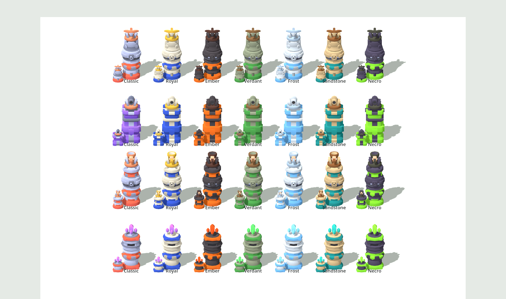
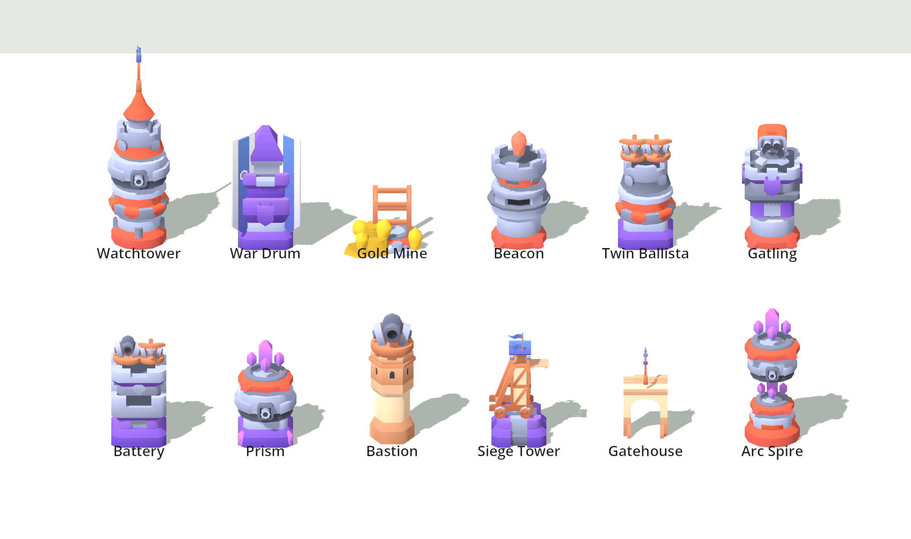

# Tower concepts and palettes (design)

Nothing here is in the game yet. These are proposals built only from the kits already in the project.
Re-render with `-- --sheet concepts <png>` / `-- --sheet palettes <png>`.

## Palettes

`TowerPalette` recolours TD Kit models by swapping swatches in the shared `colormap.png`, keeping each
swatch's shading gradient. Unlike the multiply tint on branch tops, it can lighten as well as darken.
Four channels: **stone**, **accent** (round towers' red and square towers' purple), **wood** (weapons),
and **gem** (crystals). Rows: Ballista, Cannon, Catapult, Crystal (L10 big, L1 small).

Possible uses:
- **Lane ownership:** the player gets Royal (blue) and the AI gets Ember (orange), so you can tell whose tower is whose in versus mode.
- **Branch identity:** replace the multiply tint with a palette per branch (Frost = Frost, Fire = Ember).
- **Cosmetic unlocks / map themes:** Frost on snow maps, Sandstone on desert maps, Necro for a boss-rush mode.

## New tower concepts

| Tower | Idea | Parts |
|---|---|---|
| Watchtower | Support: +1 range to towers nearby, no attack | round a stack + roof + pennant |
| War Drum | Support: +25% fire rate aura | square a + roof b + long banners |
| Gold Mine | Economy: gold every wave, no attack | round base + wood scaffold + gold-palette crystals |
| Beacon | Reveals, marks targets to take +15% damage | round b + crystal spike |
| Twin Ballista | Two bolts, alternating | square bottom, round top (hybrid) + 2 ballistas |
| Gatling | Tiny darts, very high fire rate | round bottom, square top + turret |
| Battery | Cannon + ballista; uses whichever suits the target | square c + both weapons |
| Prism | Crystal bolt splits into 3 | square/round hybrid + crystals |
| Bastion | Hex keep with a cannon; +lives for the lane | Castle Kit hexagon + TD cannon |
| Siege Tower | Spawns a blocker creep on the path | square base + Castle siege tower |
| Gatehouse | Built *on* the path; slows 30% | Castle narrow gate + flag |
| Arc Spire | Lightning that chains through 4 creeps | two crystal tiers stacked |

Castle Kit pieces (Bastion, Gatehouse) keep their own cream/orange colours because `TowerPalette` only
knows the TD Kit swatch layout. They would need their own swatch map before they can take palettes.
