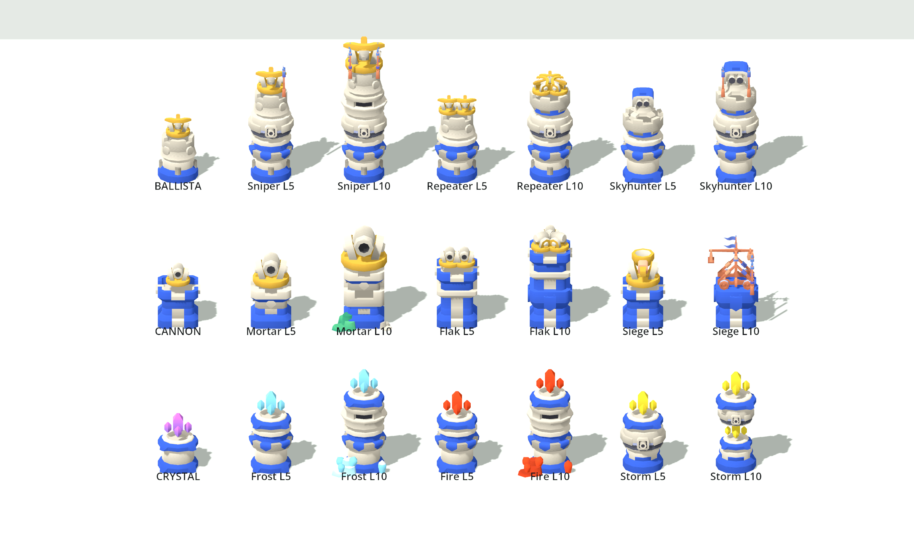
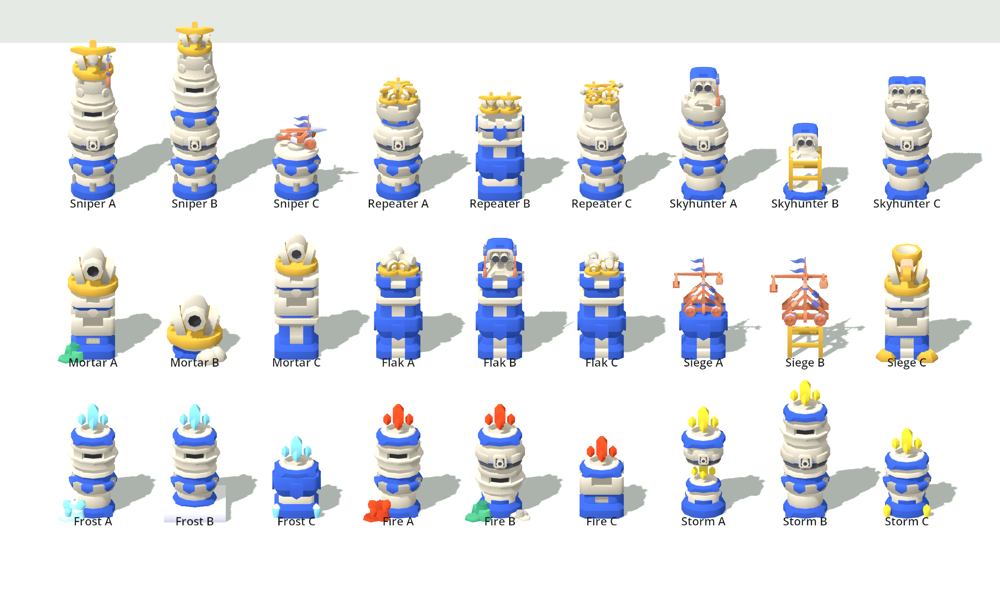

# Tower rework: 3 towers × 3 paths (proposal)

Status: proposal, not implemented. It replaces the 4-tower / 2 × 2 branch plan in `tower-branches.md`.

## Shape
- **3 base towers**, each covering one damage type: physical single-target, splash, and magic.
- At **level 5** you pick one of **3 paths**. **Level 10** is that path's capstone, with no second choice.
  That gives 9 end-forms (instead of 16), each needing an L5 look and an L10 look.
- The **Catapult is folded into the Cannon as its Siege path**, so its boss/tank role survives without
  a fourth base tower that splits the early build choice.
- Every tower L1–4 is a generalist. The path pick is the moment the tower commits to a role.

| Base | L1 | Path | Role | Hits air |
|---|---|---|---|---|
| **Ballista** | 1000g, single target | **Sniper** | range, crits, executes: bosses | yes |
| | | **Repeater** | 2 → 3 bolts at different targets: swarms | yes |
| | | **Skyhunter** | ×2 vs flyers, then air splash | yes |
| **Cannon** | 1400g, splash | **Mortar** | huge splash, long range, burning craters: packs | no |
| | | **Flak** | splash vs air, 3 shells per volley | yes |
| | | **Siege** | ×2 vs bosses/tanks, %-max-HP boulders (old Catapult) | no |
| **Crystal** | 1300g, magic, ignores ½ armour | **Frost** | slow 25% → 45%, freezes | yes |
| | | **Fire** | burn + vulnerable, spreads on death | yes |
| | | **Storm** | lightning chains 3 → 6, stuns | yes |

Research would move from tower-specific perks to path perks (e.g. "Sniper: +10% crit"), unlocked by owning that path.

## Look variants

Three L10 looks per path. **A** is the one used in the roster; **B** and **C** are alternatives to pick from.
Everything is shown in the player's blue team colours.
